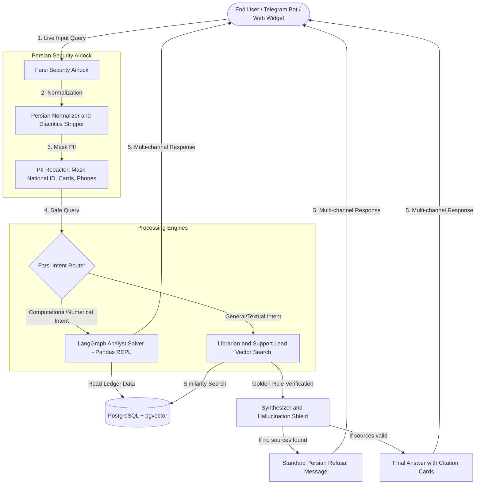

# ArioNex: Persian Enterprise AI Assistant & RAG Platform

ArioNex is an enterprise-grade Persian RAG (Retrieval-Augmented Generation) assistant with a Deep Navy and Metallic Copper design theme. It provides secure data ingestion, live Farsi PII redaction, analytical LangGraph agents, dynamic feature toggles, multi-channel gateways, and an orchestrated Docker infrastructure.

| Layer | Stack |
|-------|-------|
| Backend | FastAPI |
| Frontend | React + Vite |
| Database | PostgreSQL + pgvector |
| Object Storage | MinIO |
| Infrastructure | Docker Compose |
| Background Jobs | Celery |

---

## Table of Contents

- [System Architecture and Data Flow](#system-architecture-and-data-flow)
- [Key Features](#key-features)
- [Repository Structure](#repository-structure)
- [Quick Start and Deployment](#quick-start-and-deployment)
- [Integration Tests](#integration-tests)
- [Security and Data Governance](#security-and-data-governance)
- [License and Authorship](#license-and-authorship)

---

## System Architecture and Data Flow

ArioNex processes user input through a **Farsi Security Airlock** and routes queries between analytical solvers and semantic indexes.



---

## Key Features

- **Persian UI Theme:** A Deep Navy (`#0f1a2e`) and Metallic Copper (`#c4894a`) design system with the Vazirmatn typeface for Persian typography.
- **Farsi Security Airlock:** Sanitizes Persian inputs by standardizing Arabic characters, stripping diacritics, and normalizing localized digits.
- **Live PII Masking Preview:** Automatically censors national IDs, mobile numbers, credit card numbers, IBANs, and email addresses with live rendering in the dashboard.
- **Multi-Agent Orchestration:**
  - **Intent Router:** Zero-shot semantic matching to classify requests.
  - **Librarian Agent:** Vector search over embedded document chunks.
  - **Support Lead Agent:** FAQ CSV template matching for precise answers.
  - **LangGraph Analyst Agent:** Sandboxed pandas code generation for financial ledger computation.
- **Anti-Hallucination Guardrails:** Refuses to answer when semantic confidence falls below thresholds, issuing a polite refusal instead.
- **Outbound Gateways:** Full REST API, an asynchronous non-blocking Telegram Bot Service with session management, and a website chat widget at `/v1/widget.js`.
- **Production Containerization:** Multi-stage React + Nginx and slim FastAPI images orchestrated in a single `docker-compose.yml` with healthchecks and named volumes.
- **Web Crawler Engine:** Celery background jobs that fetch, parse, chunk, and embed website content into the vector store.

---

## Repository Structure

```text
e:\ario\
├── backend/                          # FastAPI backend application
│   ├── app/
│   │   ├── core/                     # Configuration, database, and clients
│   │   │   ├── config.py             # Pydantic settings and YAML feature-toggles loader
│   │   │   ├── database.py           # PostgreSQL pgvector connections and schemas
│   │   │   ├── logging.py            # Centralized structured logging
│   │   │   ├── llm_factory.py        # Multi-provider LLM abstraction
│   │   │   ├── embeddings.py         # Embedding generation
│   │   │   ├── minio_client.py       # Object storage with local filesystem fallback
│   │   │   ├── celery_app.py         # Celery broker configuration
│   │   │   └── local_storage.py      # Local sandbox storage fallback
│   │   ├── routes/                   # REST API routers (per-topic)
│   │   │   ├── query_routes.py       # RAG query and chat
│   │   │   ├── upload_routes.py      # Document and file upload
│   │   │   ├── config_routes.py      # Live feature-toggle configuration
│   │   │   ├── auth_routes.py        # Authentication and user management
│   │   │   ├── crawler_routes.py     # Crawl job management
│   │   │   ├── knowledge_routes.py   # Knowledge base management
│   │   │   ├── integration_routes.py # Widget and API key management
│   │   │   └── widget_routes.py      # Website chat widget endpoints
│   │   ├── logics/                   # Business logic, decoupled from routes
│   │   ├── schemas/                  # Pydantic request/response models
│   │   ├── prompts/                  # System prompt templates per agent
│   │   ├── helpers/                  # Reusable utilities (auth, CSV detector, rate limiter)
│   │   ├── tasks/                    # Celery background tasks (crawler, extraction)
│   │   └── services/                 # AI and RAG workers
│   │       ├── safety/               # PII masking and redaction
│   │       ├── retrieval/            # RAG pipeline (analyst, librarian, lawyer, QnA)
│   │       ├── integrations/         # Telegram bot and external integrations
│   │       └── workers/              # Crawler engine, text/structured/unstructured processors
│   ├── scripts/                      # Helper scripts (local data ingestion)
│   ├── Dockerfile                    # Slim Python 3.11 container
│   ├── requirements.txt              # Python dependencies
│   └── config.yaml                   # Dynamic feature-toggles configuration
│
├── frontend/                         # Vite React client application
│   ├── src/
│   │   ├── App.jsx                   # Dashboard, Chat, Upload, Admin panels
│   │   ├── main.jsx                  # SPA entry point
│   │   ├── api/                      # API client and endpoint configuration
│   │   ├── components/               # Reusable UI components
│   │   ├── constants/                # Shared constants
│   │   ├── context/                  # Global application state
│   │   ├── views/                    # Page-level components
│   │   ├── App.css
│   │   └── index.css                 # Design system and color palettes
│   ├── Dockerfile                    # Multi-stage build (Node compile, Nginx serve)
│   ├── nginx.conf                    # SPA routing configuration
│   └── package.json                  # Frontend dependencies
│
├── tests/                            # Integration test suite
│   ├── test_phase2.py                # PII airlock and normalizer tests
│   ├── test_phase3.py                # File ingestion and pandas analytics tests
│   ├── test_phase4.py                # Agent routing and anti-hallucination tests
│   ├── test_phase5.py                # Gateways, widget, and Telegram bot tests
│   └── test_phase8.py                # Global test runner
│
├── data/                             # Sample local data (structured/unstructured/QnA)
├── docs/pitch-deck/                  # Pitch-deck materials
├── knowledge_base_data/              # Knowledge base seed content
├── reports/                          # Technical documentation reports
├── docker-compose.yml                # Multi-container orchestrator
└── README.md
```

---

## Quick Start and Deployment

Deploy the React client, FastAPI backend, pgvector database, and MinIO storage with Docker Compose.

### Prerequisites

Install Docker and Docker Compose on your server.

### Environment Variables

Create a `.env` file under `backend/`. If LLM keys are left blank, ArioNex boots in **Mock Simulator Mode** with zero-embeddings and zero errors.

```env
POSTGRES_HOST=db
POSTGRES_PORT=5432
POSTGRES_USER=postgres
POSTGRES_PASSWORD=postgres
POSTGRES_DB=postgres

MINIO_ENDPOINT=minio:9000
MINIO_ROOT_USER=admin
MINIO_ROOT_PASSWORD=admin123
MINIO_BUCKET_NAME=arionex-raw-files

OPENAI_API_KEY=your_openai_api_key
TAVILY_API_KEY=your_tavily_web_search_key
TELEGRAM_BOT_TOKEN=your_telegram_bot_token
```

### Start the Stack

```powershell
docker-compose up -d --build
```

This downloads, builds, checks container health, and launches all four services.

### Service Addresses

| Service | URL |
|---------|-----|
| Admin and AI Dashboard | http://localhost (Nginx, port 80) |
| Swagger API Docs | http://localhost:8000/docs |
| MinIO Admin Console | http://localhost:9001 (admin / admin123) |

---

## Integration Tests

Run the integration test suite locally:

```powershell
$env:PYTHONIOENCODING="utf-8"
python tests/test_phase8.py
```

| Suite | Coverage | Status |
|-------|----------|--------|
| `test_phase2.py` | PII security airlock and normalizers | PASSED |
| `test_phase3.py` | Office document extraction and Excel ingestion | PASSED |
| `test_phase4.py` | Intent router, LangGraph REPL, hallucination shields | PASSED |
| `test_phase5.py` | API endpoints, widget injection, Telegram bot | PASSED |

---

## Security and Data Governance

ArioNex enforces a data sovereignty model to protect enterprise privacy:

1. **PII Sanitization:** Uploaded documents are sanitized locally in `pii_redactor.py` before chunks are passed to public or private LLM endpoints.
2. **Audit Logs:** Masking statistics are stored in the `pg_audit_logs` table for compliance tracking.
3. **Local Storage Fallback:** If MinIO is unreachable, backend modules redirect data flow to a protected local sandbox directory (`backend/storage/raw_files`).

---

## License and Authorship

Developed by **Irene-03** for Persian enterprise environments.

- **Repository:** https://github.com/Irene-03/ArioNex.git
- **Branch:** `main`

ArioNex combines data privacy, specialized mathematical ledger graph execution, and Persian RAG search into a single corporate assistant platform.