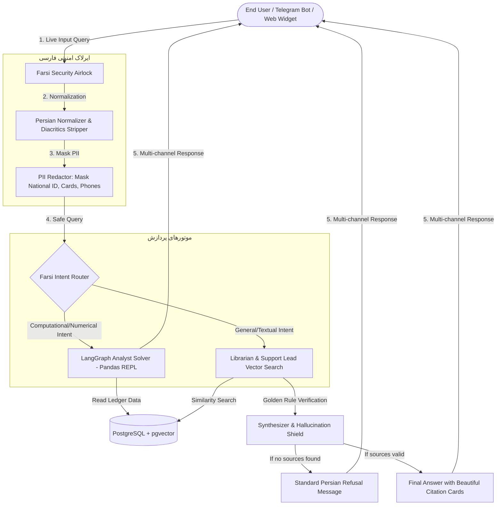

# 🏛️ ArioNex (آریونکس): Commercial Persian Enterprise AI Assistant & RAG Platform

<p align="center">
  <b>ArioNex</b> is a state-of-the-art, aristocratic-themed, enterprise-grade Persian RAG (Retrieval-Augmented Generation) assistant. Designed with a gorgeous <b>Persian Deep Navy & Metallic Copper</b> aesthetic, it offers ultra-secure data ingestion, live Farsi PII redaction, advanced analytical LangGraph agents, dynamic feature toggles, multi-channel gateways, and an orchestrated docker infrastructure.
</p>

<p align="center">
  
  
  
  
  
</p>

---

## 🗺️ System Architecture & Data Flow (معماری و جریان داده سیستم)

ArioNex coordinates safe text processing through its specialized **Farsi Security Airlock** and routes queries intelligently between analytical solvers and semantic indexes:



---

## ✨ Key Features (ویژگی‌های کلیدی آریونکس)

*   **👑 Aristocratic Persian UI Theme:** Built with a stunning Deep Navy (`#0f1a2e`) and Classic Metallic Copper (`#c4894a`) visual design system using Google Fonts Outfit/Inter and **Vazirmatn** for beautiful Persian typography.
*   **🛡️ Farsi Security Airlock:** Proactively sanitizes Persian inputs by standardizing Arabic characters (ی/ک), stripping diacritics, and translating localized digits to database numerals.
*   **🔒 Live PII Masking Preview:** Automatically censors National IDs, mobile phone numbers, credit card numbers, IBANs (Sheba), and email addresses with side-by-side live rendering inside the dashboard upload tab.
*   **🤖 Multi-Agent Orchestration:**
    *   **Intent Router:** Uses zero-shot semantic matching to classify requests.
    *   **Librarian Agent:** Searches database embeddings for semantically closest text chunks.
    *   **Support Lead Agent:** Matches FAQ CSV templates to ensure precise organizational answers.
    *   **LangGraph Analyst Agent:** Writes dynamic pandas Python code within a sandboxed interpreter to run computations on financial ledgers.
*   **🛡️ Anti-Hallucination Guardrails:** Implements the golden rule of enterprise RAG: if semantic matches fall below thresholds, it refuses to hallucinate and issues a standard polite Persian refusal.
*   **🔌 Plentiful Outbound Gateways:** Includes a full REST API, an asynchronous, non-blocking **Telegram Bot Service** with chat session management, and a custom **Website Chat Widget** (`/v1/widget.js`).
*   **🐳 Production-Ready Containerization:** Multi-stage React + Nginx setup and optimized slim FastAPI deployments configured in a single `docker-compose.yml` with healthchecks and named volume persistence.

---

## 📂 Repository File Structure (ساختار فیزیکی فایل‌ها)

```text
e:\ario\
├── backend/                        # FastAPI Backend Application
│   ├── app/
│   │   ├── core/                   # Configurations, Database & Clients
│   │   │   ├── config.py           # Pydantic Settings & YAML feature toggles loader
│   │   │   ├── database.py         # Postgres pgvector connections and schemas
│   │   │   ├── logging.py          # Unified system loggers (English)
│   │   │   └── minio_client.py     # Object storage client with local filesystem fallback
│   │   ├── endpoints/
│   │   │   └── routes.py           # REST API Route Handlers
│   │   └── services/               # AI & RAG Expert Workers
│   │       ├── safety/
│   │       │   └── pii_redactor.py # PII Masking & Security Auditing
│   │       └── workers/
│   │           ├── text_processor.py# Farsi normalizer & sliding window chunker
│   │           ├── unstructured.py # Docx/PDF/TXT text parsing engine
│   │           ├── analyst.py      # LangGraph computational pandas REPL solver
│   │           ├── librarian.py    # Vector DB retriever
│   │           └── support_lead.py # QnA template matcher
│   ├── Dockerfile                  # Lightweight Python 3.11-slim container
│   ├── requirements.txt            # Python dependencies
│   └── config.yaml                 # Active dynamic feature toggles config
│
├── frontend/                       # Vite React Client Application
│   ├── src/
│   │   ├── App.jsx                 # Dynamic Dashboard, Chat, Upload, Admin Panels
│   │   ├── App.css                 # Custom chat bubble and PII container CSS
│   │   ├── index.css               # Design system & Persian color palettes
│   │   └── main.jsx                # SPA Client entry point
│   ├── Dockerfile                  # Multi-stage build (Node.js compile -> Nginx serve)
│   ├── nginx.conf                  # Nginx router with SPA Try-Files configuration
│   └── package.json                # Frontend package dependencies
│
├── tests/                          # Quality Control Integration Test Suite
│   ├── test_phase2.py              # PII Airlock & normalizer tests
│   ├── test_phase3.py              # File ingestion & pandas analytics tests
│   ├── test_phase4.py              # Agent routing & anti-hallucination tests
│   ├── test_phase5.py              # Gateways, Widget & Telegram Bot tests
│   └── test_phase7.py              # Integrated global test runner script
│
├── docker-compose.yml              # Central multi-container orchestrator
└── reports/                        # Detailed technical documentation reports
```

---

## 🚀 Quick Start & Deployment Guide (راهنمای راه‌اندازی سریع)

Deploy the entire commercial ArioNex network containing **React Client, FastAPI Backend, pgvector Database, and MinIO Ingestion storage** in minutes:

### 1. Prerequisites
Ensure you have **Docker** and **Docker Compose** installed on your server.

### 2. Configure Environment Variables
Create a `.env` file under the `backend/` directory (if LLM keys are blank, ArioNex will gracefully boot in **Mock Simulator Mode** with zero-embeddings and zero errors):
```env
POSTGRES_HOST=db
POSTGRES_PORT=5432
POSTGRES_USER=postgres
POSTGRES_PASSWORD=postgres
POSTGRES_DB=postgres

MINIO_ENDPOINT=minio:9000
MINIO_ROOT_USER=admin
MINIO_ROOT_PASSWORD=admin123
MINIO_BUCKET_NAME=arionex-raw-files

OPENAI_API_KEY=your_openai_api_key
TAVILY_API_KEY=your_tavily_web_search_key
TELEGRAM_BOT_TOKEN=your_telegram_bot_token
```

### 3. Spin Up the Network
From the root workspace directory, run:
```powershell
docker-compose up -d --build
```
This automatically downloads, builds, checks container health, links network pathways, and launches all 4 services.

### 4. Direct Service Addresses
*   **👑 Administrative & AI Dashboard:** [http://localhost](http://localhost) (Served via Nginx Port 80)
*   **🔌 Swagger OpenAPI Interactive Docs:** [http://localhost:8000/docs](http://localhost:8000/docs)
*   **💾 MinIO Admin Console:** [http://localhost:9001](http://localhost:9001) (User: `admin` | Pass: `admin123`)

---

## 🏆 System Integration Tests Status (وضعیت پاس شدن تست‌ها)

All core components of the ArioNex suite are validated and confirmed **100% stable** under the global test runner. Run the integration test suite locally:

```powershell
$env:PYTHONIOENCODING="utf-8"
python tests/test_phase7.py
```

### Grand Test Results:
*   `test_phase2.py` (PII Security Airlock & Normalizers) : ✅ **PASSED**
*   `test_phase3.py` (Office Document Extraction & Excel Pandas Ingestion) : ✅ **PASSED**
*   `test_phase4.py` (Intent Router, LangGraph REPL, Hallucination Shields) : ✅ **PASSED**
*   `test_phase5.py` (API Endpoints, Live Widget Injections, Async Telegram Bot) : ✅ **PASSED**

---

## 🔒 Farsi Security Airlock & Data Governance

ArioNex implements a rigorous data sovereignty model to protect enterprise privacy:
1.  **PII Sanitization:** Documents uploaded are sanitized locally in `pii_redactor.py` before passing chunks to public or private LLM endpoints.
2.  **Audit Logs:** Masking statistics are categorized and stored in the database's `pg_audit_logs` table for compliance tracking.
3.  **Local storage fallback:** If Cloud MinIO is unreachable, backend modules seamlessly redirect data flow to a protected local sandbox directory (`backend/storage/raw_files`).

---

## 💎 Commercial License & Authorship

Developed by **Irene-03** for premium Persian enterprise environments.
*   **Private Git Repository:** [https://github.com/Irene-03/ArioNex.git](https://github.com/Irene-03/ArioNex.git)
*   **Branch:** `main`

ArioNex offers an elite corporate assistant experience by combining data privacy, specialized mathematical ledgers graph execution, and flawless Persian RAG search.
