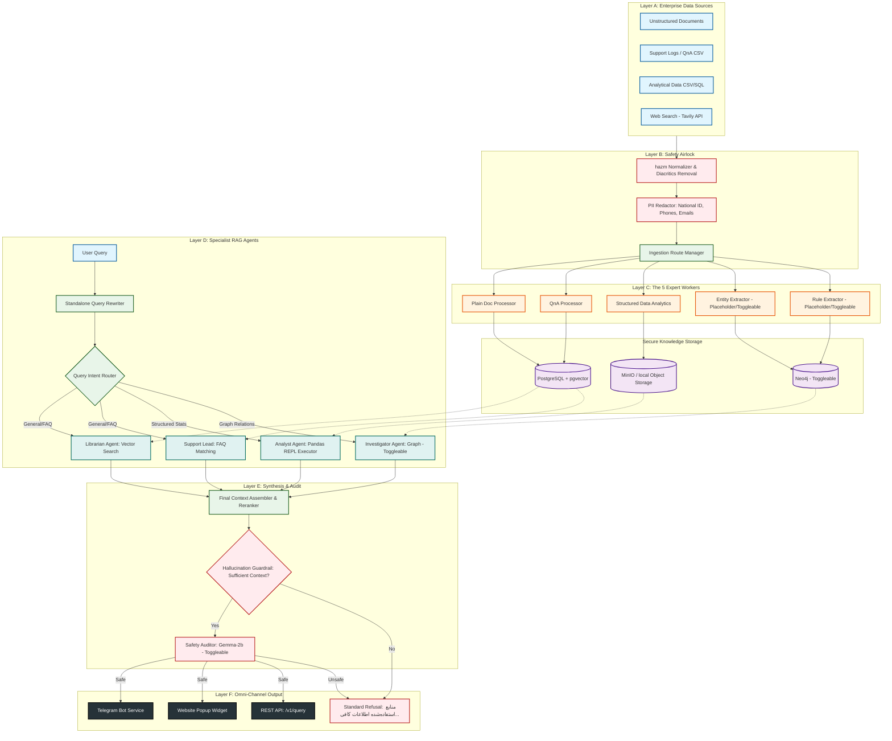

# سند طرح فنی و پیاده‌سازی سامانه هوشمند تجاری «آریونکس» (ArioNex)

این سند شامل نقشه راه دقیق، معماری سیستم، جزئیات فنی و مراحل پیاده‌سازی گام‌به‌گام دستیار هوش سازمانی **«آریونکس» (ArioNex)** یا **«آریو»** در ۷ فاز عملیاتی است. این محصول با دید تجاری در سطح جهانی، طراحی ماژولار و رعایت استانداردهای امنیتی، عدم توهم (Non-Hallucination) و مدیریت هویت بصری لوکس ایرانی (Vintage & Aristocratic Aesthetic) پیاده‌سازی خواهد شد.

---

## معماری و ساختار کلی پروژه (Proposed Architecture)

سیستم به صورت **لوکس، تمیز و ماژولار** با جداسازی کامل فرانت‌اند (React) و بک‌اند (FastAPI) طراحی می‌شود:



---

## راهنمای کامنت‌نویسی و مستندسازی (Strict Documentation Standard)

تمامی کدهای پروژه باید استاندارد دقیق مستندسازی خواسته شده را رعایت کنند:
*   **زبان لاگ‌ها و خطاهای سیستم:** کاملاً به زبان **انگلیسی** (بمنظور سهولت مانیتورینگ و توسعه‌دهندگان فرامرز).
*   **زبان کامنت‌ها و توضیحات کد:** کاملاً به زبان **فارسی روان و ساختاریافته**.

### نمونه استاندارد کامنت برای کلاس‌ها و توابع در پایتون:
```python
class DocumentChunker:
    """
    /// <summary>
    /// مسئولیت اصلی این کلاس شکستن متون طولانی به چانک‌های استاندارد RAG است.
    /// </summary>
    /// <remarks>
    /// این کلاس از الگوریتم پنجره لغزان با Overlap مشخص برای حفظ بافت متن استفاده می‌کند.
    /// </remarks>
    """
    
    def chunk_text(self, text: str, chunk_size: int = 350, overlap: int = 75) -> list[str]:
        """
        /// <summary>
        /// شرح کامل کاری که متد انجام می‌دهد: متن ورودی را بر اساس کلمات تقسیم کرده و تکه‌های هم‌پوشان ایجاد می‌کند.
        /// </summary>
        /// <param name="text">متن نرمال‌شده ورودی (نوع: string)</param>
        /// <param name="chunk_size">اندازه هر تکه بر اساس تعداد کلمات (پیش‌فرض: ۳۵۰)</param>
        /// <param name="overlap">تعداد کلمات هم‌پوشان بین دو تکه متوالی (پیش‌فرض: ۷۵)</param>
        /// <returns>لیستی از رشته‌های متنی خرد شده</returns>
        /// <exception cref="ValueError">در صورتی که طول متن خالی باشد یا overlap بیشتر از chunk_size باشد</exception>
        """
        if not text:
            raise ValueError("Input text cannot be empty.")
        # منطق تقسیم متن...
```

---

## فازهای ۷گانه پیاده‌سازی (The 7-Phase Execution Plan)

### فاز ۱: زیرساخت، ساختار پروژه و پیکربندی داینامیک (Infrastructure & Configuration)
*   **سمت بک‌اند:** ایجاد ساختار دایرکتوری ماژولار و راه‌اندازی FastAPI. پیاده‌سازی مکانیزم بارگذاری تنظیمات از فایل مرکزی `config.yaml` و متغیرهای محیطی `.env` به صورت کاملاً تفکیک‌شده (Feature Toggles) برای فعال/غیرفعال‌سازی ماژول‌ها.
*   **پایگاه داده و ذخیره‌ساز:** نوشتن اسکریپت‌های اتصال و راه‌اندازی **PostgreSQL + pgvector** و شبیه‌سازی/تنظیم کلاس‌های اتصال **MinIO** جهت نگهداری نسخه‌های اصلی فایل‌ها.
*   **سمت فرانت‌اند:** راه‌اندازی پروژه React مدرن با Vite به همراه سیستم مدیریت استایل تمیز و همساز با تم ایرانی و لایه‌بندی سایدبار.

### فاز ۲: ایرلاک امنیتی، پردازش و نرمال‌سازی متون فارسی (Safety Airlock & Farsi Pipeline)
*   **نرمال‌ساز متن:** پیاده‌سازی لایه نرمال‌ساز متن فارسی با استفاده از کتابخانه `hazm` به همراه یکدست‌سازی نویسه‌های عربی به فارسی، حذف اعراب، استانداردسازی اعداد و فاصله مجازی (بر اساس کدهای `utils.py` دمو).
*   **ایرلاک امنیتی و PII Redaction:** نوشتن ماژول شناسایی و ماسک کردن خودکار اطلاعات حساس کسب‌وکار و حریم خصوصی کارمندان (مانند کدهای ملی، شماره تلفن‌ها، ایمیل‌ها و شماره حساب‌ها با عبارات منظم پیشرفته) قبل از ورود داده‌ها به موتور برداری.
*   **چانک‌ساز هوشمند:** الگوریتم تقسیم‌کننده متون به چانک‌های ۳۵۰ کلمه‌ای با هم‌پوشانی ۷۵ کلمه.

### فاز ۳: پردازشگرهای تخصصی و استخراج داده (Expert Ingestion Workers)
*   **Unstructured Document Processor:** خواندن و پردازش فایل‌های متنی و PDF و Word (`.docx`, `.pdf`, `.txt`) و استخراج چانک‌ها و ایجاد امبدینگ با مدل `text-embedding-3-large` (طول ۳۰۷۲) و ذخیره در جدول `pg_supervisor`.
*   **QnA Processor:** پردازش فایل‌های الگوهای پرسش و پاسخ CSV و لاگ‌های پشتیبانی و ذخیره در جدول `qna_query`.
*   **Structured Data Analytics (CSV/SQL):** پیاده‌سازی بخش لود داده‌های ساختاریافته مالی و حسابداری از فایل‌های CSV به داخل دیتابیس یا پانداس جهت تحلیل‌های مبتنی بر کد پایتون.
*   **سرویس‌های انتخابی (Toggleable Services):** پیاده‌سازی ساختار ماژولار و ایزوله برای ماژول‌های `entity_extractor` و `rule_extractor` و `neo4j` به نحوی که اگر در `config.yaml` غیرفعال باشند، بقیه سیستم بدون مشکل و مستقل به کار خود ادامه دهد.

### فاز ۴: موتور جستجوی معنایی و عامل‌های RAG امن (Search & Retrieval Engine)
*   **بخش Standalone Query:** پیاده‌سازی زنجیره بازنویسی پرسش کاربر بر اساس تاریخچه چت (برای برطرف کردن ابهام در جملات متوالی) با استفاده از پرامپت StandAlone.
*   **عامل‌های تخصصی RAG:**
    *   **The Librarian (عامل متون):** جستجوی معنایی پیشرفته روی اسناد در جدول `pg_supervisor` یا جدول dummy.
    *   **The Support Lead (عامل سوال و جواب):** جستجوی شباهت سوالات رایج بر اساس جدول `qna_query`.
    *   **The Analyst (عامل تحلیلگر داده):** ابزار هوشمند اجرای سناریوهای مالی روی دیتای حسابداری با استفاده از کتابخانه pandas و اجرای کدهای امن در محیط کنترل شده REPL (همانند دموی لنگ‌گراف).
*   **ترکیب‌کننده و رتبه‌بندی (Synthesizer & Reranker):** تجمیع نتایج عامل‌ها و مرتب‌سازی بر اساس امتیاز شباهت cosine.
*   **قانون طلایی عدم توهم:** پیاده‌سازی اعتبارسنجی دقیق روی متون بازیابی شده. در صورتی که محتوای مناسبی یافت نشد یا مدل خروجی `"####"` بازگرداند، حتماً متن Refusal زیر بازگردانده شود:
    > "منابع استفاده‌شده اطلاعات کافی و مناسبی درباره‌ی پرسش شما ارائه نمی‌دهند."

### فاز ۵: درگاه‌های خروجی و ارتباطی چندگانه (Omni-Channel Integration)
*   **REST API:** اندپوینت استاندارد `/v1/query` جهت دریافت پرسش‌ها به همراه شناسه‌های نشست (Session Management) به صورت تمیز.
*   **Telegram Bot Service:** راه‌اندازی ربات تلگرام متصل به بک‌اند بکپارچه با مدیریت حافظه نشست‌ها تا کاربران درون‌سازمانی بتوانند در بستری امن سوالات خود را بپرسند.
*   **Website Pop-up Widget:** توسعه فایل جاوااسکریپت پاپ‌آپ سبک با طراحی زیبا و متحرک که به راحتی با قرار دادن یک تگ `<script>` درون کدهای هر وب‌سایتی لود شده و چت‌باکس را با بک‌اند سینک کند.
*   **ابزار جستجوی وب (Web Search Integration):** ادغام جستجوی زنده Tavily API به عنوان یک Expert Worker دیگر، فعال شونده در صورتی که پایگاه دانش داخلی اطلاعات کافی نداشته باشد (در صورت فعال بودن در کانفیگ).

### فاز ۶: رابط کاربری مدرن، داشبورد مجلل و چت آریونکس (Vintage & Premium UI/UX)
*   **پالت رنگی شاهانه و کلاسیک کسب‌وکار ایرانی:** استفاده از ترکیب رنگ‌های سرمه‌ای عمیق (`#0f1a2e`)، سرمه‌ای برند (`#1a2744`)، مس کلاسیک و درخشان (`#c4894a`, `#d9a96e`) و پس‌زمینه کرم/سفید کلاسیک (`#f8f6f3`). استفاده از فونت محبوب فارسی **Vazirmatn** با سایزها و ضخامت‌های اصولی.
*   **پنل مدیریت (Admin Dashboard):**
    *   نمایش آمارهای زنده دیتابیس و پردازش فایل‌ها.
    *   بخش فعال/غیرفعال‌سازی داینامیک سرویس‌ها (Toggle switches) برای تک‌تک ماژول‌ها و درگاه‌های خروجی.
    *   پیش‌نمایش زنده ماسک شدن اطلاعات حساس (PII Redaction Preview) با هایلایت کردن داده‌های حذف شده.
    *   بخش مدیریت کاربران و دسترسی‌ها (با نقش‌های مدیر ارشد، مدیر، تحلیلگر و بیننده) به همراه دکمه دعوت کاربر جدید.
    *   بخش مدیریت و ویرایش پرامپت‌ها و دستورالعمل‌های پایه سیستم (System Instruction).
*   **صفحه چت هوشمند:** محیط چت پویا با لود عالی و افکت‌ها و انیمیشن‌های میکرو، دکمه‌های کپی پاسخ، نمایش تگ‌های دقیق منابع ارجاع داده شده (سند حسابداری، شماره صفحه و نام فایل) در زیر هر پاسخ، و تگ‌های ایمنی/عدم توهم.
*   **صفحه آپلود و مدیریت اسناد:** رابط آپلود کشیدن و رها کردن فایل‌ها به همراه نشان‌دهنده میزان پیشرفت پردازش چانک‌ها.

### فاز ۷: تست فراگیر، داکرایز کردن و استقرار پایدار (Testing, DevOps & Deployment)
*   **تست‌ها:** نوشتن تست‌های واحد (Unit Tests) برای لایه نرمال‌ساز متن، ماژول PII، موتور جستجوی معنایی و رفتارهای عدم توهم.
*   **DevOps:** نوشتن فایل‌های `Dockerfile` استاندارد برای فرانت‌اند و بک‌اند و پیکربندی `docker-compose.yml` به همراه PostgreSQL، pgvector و شبیه‌سازها جهت راه‌اندازی سریع با یک دستور.
*   **استقرار و لاگ‌نویسی:** پیاده‌سازی لاگ‌نویسی سیستمی انگلیسی و مدیریت محیط‌های Production و Development.

---

## بررسی بخش‌های مورد نیاز برای تایید کاربر (User Review Required)

> [!IMPORTANT]
> برای تطابق دقیق با انتظارات شما و پیاده‌سازی عالی، لطفا موارد زیر را بررسی و تایید بفرمایید:
> 
> ۱. **ابزار جستجوی وب (Web Search):** آیا دسترسی به API Key برای **Tavily** فراهم است یا تمایل دارید از متد جستجوی آزاد وب (مانند DuckDuckGo API) به صورت جایگزین استفاده شود؟
> 
> ۲. **پایگاه داده برداری (Vector DB):** پیاده‌سازی با PostgreSQL و افزونه `pgvector` به صورت کانتینری انجام می‌شود. آیا تنظیمات خاصی در سرور شما وجود دارد که باید در فایل‌های کانفیگ داکر لحاظ کنیم؟
> 
> ۳. **مدل زبان بزرگ (LLM):** در دموی شما از مدل‌های OpenAI (مانند `gpt-4o-mini` یا `gpt-4`) استفاده شده است. آیا می‌خواهید کماکان روی کدهای تجاری از مدل‌های OpenAI با API استفاده کنیم یا به مدل‌های سازمانی دیگر (مانند Gemini API) مهاجرت کنیم؟ پرامپت‌ها را کاملا عمومی و بهینه می‌نویسیم تا با کمترین مصرف توکن و بیشترین دقت در هر دو محیط کار کند.

---

## برنامه راستی‌آزمایی (Verification Plan)

### تست‌های خودکار (Automated Tests)
*   اجرای تست‌های پایتون با `pytest` برای بررسی لایه PII Redaction و اطمینان از حذف متغیرهای حساس.
*   تست سناریوهای RAG برای بررسی قانون عدم توهم: ارسال پرسش‌هایی خارج از اطلاعات پایگاه دانش و صحت‌سنجی دریافت دقیق Refusal متنی فارسی.
*   بررسی عملکرد وایرفریم React و صحت سوییچ بین صفحات در کامپوننت‌های روتینگ.

### تست‌های دستی و بصری (Manual & Visual Verification)
*   بررسی رابط کاربری React روی مرورگر و اطمینان از کیفیت بصری لوکس، روان بودن هاورها و متحرک‌سازی‌ها، و زیبایی پالت رنگی سورمه‌ای و مس.
*   تست عملیاتی ربات تلگرام با ارسال فایل و طرح پرسش‌های مالی.
*   قرار دادن تگ اسکریپت پاپ‌آپ چت روی یک صفحه وب نمونه و تایید لود تمیز چت‌باکس شناور در گوشه صفحه.

---

**لطفاً پس از بررسی این طرح فنی جامع، موافقت خود را اعلام بفرمایید تا عملیات پیاده‌سازی گام‌به‌گام فاز ۱ تا ۷ را در دایرکتوری اصلی آغاز کنیم.**
