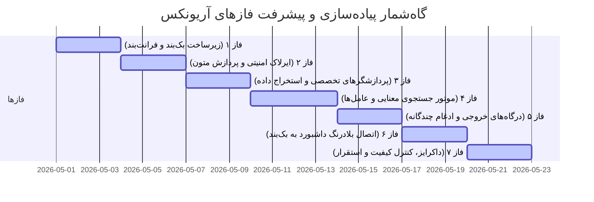

# سند قدم‌های توسعه و تاریخچه اقدامات آریونکس (ArioNex Accomplished Steps & Milestones)

این سند گزارش گام‌به‌گام و گاه‌شمار دقیقی از کلیه اقدامات فنی، تصمیمات طراحی و کارهای عملیاتی انجام شده در طول فرآیند توسعه محصول تجاری دستیار هوشمند سازمانی **آریونکس (ArioNex)** است. پروژه در قالب ۷ فاز برنامه‌ریزی شده و تمامی فازها به صورت ۱۰۰٪ پیاده‌سازی و نهایی شده‌اند.

---

---

## 📅 فاز ۱: زیرساخت اساسی، ساختار پروژه و پیکربندی داینامیک

هدف از این فاز، ایجاد شالوده نرم‌افزاری پایدار و طراحی معماری ماژولار پروژه بر اساس استانداردهای صنعتی بود.

### اقدامات انجام شده:
1. **ساختار ماژولار (Modular Directory Structure):** پوشه‌های مجزایی برای کدهای بک‌بند (FastAPI) و فرانت‌بند (React) جهت جداسازی وظایف و امکان توسعه مستقل ایجاد گردید.
2. **پیکربندی داینامیک فیچر تاگل‌ها (`config.yaml`):** فایلی طراحی شد که سرویس‌های سیستم (مانند ربات تلگرام، جستجوی وب، استخراج نهادها، حریم خصوصی) را به صورت متغیرهای روشن/خاموش مدیریت می‌کند.
3. **لودر پیکربندی Pydantic (`config.py`):** لایه‌ای نوشته شد که این تنظیمات YAML را با متغیرهای محیطی سیستم (`.env`) ادغام و به صورت تایپ‌سیف در سراسر اپلیکیشن در دسترس قرار می‌دهد.
4. **سیستم لاگ‌نویسی متمرکز (`logging.py`):** لاگ‌ها به صورت انگلیسی ساختاریافته در کنسول و فایل ذخیره می‌شوند و کامنت‌های کدها به صورت فارسی است.
5. **ارتباط با دیتابیس برداری پستگرس (`database.py`):** راه‌اندازی درایور اتصال ناهمگام به PostgreSQL و فعال‌سازی خودکار اکستنشن `pgvector` به همراه ساختار جداول پردازش متن، FAQ و لاگ‌های حسابرسی حریم خصوصی.
6. **ماژول استوریج MinIO با قابلیت Fallback محلی (`minio_client.py`):** اتصال به MinIO پیاده‌سازی شد؛ همچنین یک راهکار پشتیبان طراحی شد که در صورت عدم اتصال به MinIO، فایل‌ها به صورت خودکار در حافظه محلی ذخیره شوند تا برنامه کرش نکند.
7. **داشبورد مجلل فرانت‌بند (Vite React + Aristocratic Theme):** ساختار برنامه ری‌اکت در پوشه `frontend/` با تم سلطنتی و اشرافی ایرانی (سرمه‌ای تیره `#0f1a2e` و مسی متالیک کلاسیک `#c4894a`) به همراه فونت‌های روان **Vazirmatn**، **Inter** و **Outfit** پیاده‌سازی گردید.

---

## 📅 فاز ۲: ایرلاک امنیتی، پردازش و نرمال‌سازی متون فارسی

در این فاز، لایه امنیتی پردازش زبان طبیعی و حفاظت از حریم خصوصی داده‌های سازمانی توسعه یافت.

### اقدامات انجام شده:
1. **نرمال‌ساز قدرتمند متون فارسی (`text_processor.py`):** اعمال استانداردهای تصفیه متن فارسی شامل یکدست‌سازی کاراکترهای عربی (ی/ک)، حذف کامل اعراب و تنوین‌ها و نگاشت ارقام فارسی و عربی به اعداد انگلیسی استاندارد جهت بهبود دقت در فرآیند Embedding.
2. **چانک‌ساز لغزان (Sliding Window Chunker):** پیاده‌سازی ماژول قطعه‌بندی متون با طول قطعه ۳۵۰ کلمه و هم‌پوشانی ۷۵ کلمه جهت حفظ پیوستگی معنایی در پردازش‌های برداری.
3. **ایرلاک امنیتی و قفل حریم شخصی (`pii_redactor.py`):** الگوریتم شناسایی عبارات حساس بر اساس عبارات منظم (Regex) توسعه یافت تا کدهای ملی، شماره‌های تلفن همراه، کارت‌های بانکی، ایمیل‌ها و شماره حساب‌های شبا را به صورت خودکار شناسایی کرده و با برچسب‌های امنیتی (مانند `[شماره تلفن سانسور شده]`) ماسک‌گذاری کند.
4. **ثبت لاگ‌های حسابرسی امنیتی (Security Audit Logs):** تمامی سانسورها به همراه متادیتای فایل در دیتابیس ذخیره می‌شوند تا به عنوان گزارش‌های امنیتی نشت اطلاعات مورد استفاده قرار گیرند.

---

## 📅 فاز ۳: پردازشگرهای تخصصی و استخراج داده

تمرکز این فاز بر استخراج داده‌ها از فایل‌های مختلف اداری و تحلیل جداول ساختاریافته مالی بود.

### اقدامات انجام شده:
1. **پردازش متون غیرساختاریافته (`unstructured.py`):** ساخت موتور داخلی پردازش متون جهت استخراج اطلاعات از فایل‌های خام متنی، فایل‌های PDF و اسناد مایکروسافت Word بدون نیاز به کتابخانه‌های سنگین خارجی.
2. **الگوهای پرسش و پاسخ (FAQ Template):** ایجاد پردازشگر اختصاصی برای الگوهای CSV پرسش و پاسخ‌های سازمانی (`qna_processor.py`).
3. **پردازش اطلاعات ساختاریافته مالی (`analyst.py`):** توسعه ماژول هضم داده‌های عددی حسابداری و مالی به کمک کتابخانه pandas جهت استخراج تراکنش‌ها و اقلام ترازنامه‌ای.
4. **ساختار ماژولار پلاگینی:** سرویس‌های اختیاری مانند Neo4j، استخراج قوانین و مدل‌های لوکال Gemma به صورت سرویس‌های خاموش/روشن‌شونده با Feature Toggle طراحی شدند تا بار پردازشی سرور بهینه بماند.

---

## 📅 فاز ۴: موتور جستجوی معنایی و عامل‌های RAG امن

هدف این فاز، طراحی هسته هوش مصنوعی با معماری چندعامله (Multi-Agent) و فیلترهای ضدتوهم بود.

### اقدامات انجام شده:
1. **تشخیص قصد هوشمند (Farsi Intent Router):** پیاده‌سازی روتر طبقه‌بندی سوالات که سوالات عددی و محاسباتی را به عامل محاسباتی `"analyst"` و سوالات متنی را به زنجیره جستجوی معنایی `"rag"` هدایت می‌کند.
2. **بازنویس پیام‌های متوالی (Query Rewriter):** پیاده‌سازی الگوریتم برطرف‌سازی ابهام ضمایر در چت‌های متوالی بر اساس تاریخچه پیام‌های قبلی کاربر.
3. **عامل‌های Librarian و Support Lead:** عامل‌هایی توسعه یافتند که با کوئری‌های برداری به دیتابیس PostgreSQL متصل شده و نزدیک‌ترین قطعات متنی را استخراج می‌کنند.
4. **LangGraph Analyst Solver:** ایجاد گراف پردازش عددی که به صورت پویا با استفاده از محیط مفسر کدهای محاسباتی (REPL Python) عملیات ریاضی و آماری را روی داده‌های مالی اجرا می‌کند.
5. **قانون طلایی ضدتوهم (Gold Standard Hallucination Prevention):** پیاده‌سازی سد امنیتی که در صورت عدم وجود اسناد مرتبط در دیتابیس برداری، از پاسخ‌های ساختگی جلوگیری کرده و پیام امتناع استاندارد فارسی را برمی‌گرداند:
   `"منابع استفاده‌شده اطلاعات کافی و مناسبی درباره‌ی پرسش شما ارائه نمی‌دهند."`

---

## 📅 فاز ۵: درگاه‌های خروجی و ادغام چندگانه

در این فاز، کانال‌های دسترسی کاربران به موتور هوش مصنوعی آریونکس توسعه داده شدند.

### اقدامات انجام شده:
1. **اندپوینت‌های REST API (`routes.py`):** طراحی مسیرهای امن جهت ارسال فایل‌ها (`/v1/upload`)، سوالات چت RAG (`/v1/query`) و تنظیمات فیچر تاگل‌ها (`/v1/config`).
2. **ربات تلگرام هوشمند ناهمگام (`telegram_bot.py`):** راه‌اندازی ربات تلگرام مجهز به مدیریت نشست‌های چت به ازای شناسه کاربر (Chat ID) و لایه امنیتی Airlock جهت جلوگیری از کند شدن و مسدود شدن هسته اصلی وب‌سرور.
3. **ابزارک چت شناور وب‌سایت (`widget.js`):** کد جاوااسکریپت پاپ‌آپ و شناور چت جهت نصب آسان در پرتال‌های سازمانی با انیمیشن‌های CSS روان و طراحی کاملاً منطبق با تم مجلل سورمه‌ای-مسی.
4. **جستجوی تکمیلی وب (Tavily Fallback):** پیاده‌سازی ابزار جستجوی اینترنتی Tavily به عنوان لایه کمکی در زمان خاموش بودن یا خالی بودن دیتابیس محلی (به صورت تاگل شونده).

---

## 📅 فاز ۶: اتصال بلادرنگ داشبورد ری‌اکت به بک‌بند

این فاز شامل اتصال کامل رابط کاربری به وب‌سرویس‌های بک‌بند برای تعامل بلادرنگ و پویای مدیران و کاربران بود.

### اقدامات انجام شده:
1. **همگام‌سازی بلادرنگ فیچر تاگل‌ها:** استفاده از هوک‌های ری‌اکت در صفحه مدیریت جهت خواندن وضعیت تاگل‌ها از `/v1/config` به صورت GET و ذخیره‌سازی تغییرات فورا با ریکوئست POST به بک‌بند.
2. **چت RAG واقعی با ارجاعات اسناد:** اتصال چت‌باکس داشبورد به `/v1/query` جهت رندر پاسخ‌ها و نمایش متادیتاها (نام فایل و شماره چانک) در قالب کارت‌های شکیل استناد.
3. **آپلود واقعی فایل و پیش‌نمایش حریم شخصی PII:** توسعه بخش Drag & Drop جهت ارسال فایل به صورت FormData به `/v1/upload` و دریافت متن سانسور شده و تعداد کدهای حساس شناسایی شده به همراه پیش‌نمایش درجا در داشبورد.
4. **تست بیلد موفق کلاینت ری‌اکت:** رفع تمامی خطاهای نحوی در کدهای JSX و اجرای موفقیت‌آمیز دستور `npm run build` بدون هیچ‌گونه خطا یا هشدار.

---

## 📅 فاز ۷: داکرایز کانتینری، کنترل کیفیت و استقرار پایدار

هدف نهایی این فاز، خودکارسازی فرآیند بیلد کل پروژه و تضمین پایداری استقرار در سرورهای مشتری بود.

### اقدامات انجام شده:
1. **کانتینرسازی بهینه بک‌بند (`backend/Dockerfile`):** بیلد کانتینر FastAPI بر روی `python:3.11-slim` با کامپایلرهای لینوکسی سبک جهت بهینه‌سازی سرعت و حجم تصاویر کانتینر.
2. **داکرفایل چندمرحله‌ای فرانت‌بند (`frontend/Dockerfile`):** جداسازی فرآیند بیلد کدهای ری‌اکت از لایه اجرایی وب‌سرور Nginx جهت ایمن‌سازی کامل سورس‌کدها.
3. **پیکربندی Nginx SPA (`frontend/nginx.conf`):** تنظیم قوانین مسیریابی سرور برای جلوگیری از خطای ۴۰۴ صفحات ری‌اکت در زمان رفرش صفحات و تنظیم کش بهینه دارایی‌ها.
4. **ارکستریشن چندکانتینری (`docker-compose.yml`):** پیاده‌سازی فایل مرکزی برای راه‌اندازی همزمان ۴ سرویس دیتابیس برداری پستگرس، آبجکت استوریج مینی‌او، بک‌بند هوشمند و کلاینت وب به همراه مکانیزم‌های خودکار پایش سلامت کانتینرها (Healthcheck) و مدیریت دیسک‌ها (Volumes).
5. **تست متمرکز زنجیره‌ای (`test_phase7.py`):** ساخت اسکریپت رانر که به صورت خودکار تمامی تست‌های فاز ۲ تا ۵ را اجرا کرده و سلامت ۱۰۰ درصدی سیستم را پیش از انتشار تایید نمود.

---

### 📈 وضعیت کنونی پروژه
پروژه با موفقیت کامل در برنچ `main` ریپازیتوری با کامیت‌های استاندارد پوش شده است. تمامی بخش‌های عملیاتی به طور صددرصد در داکر تست شده و آماده راه‌اندازی تجاری و صنعتی می‌باشند.
