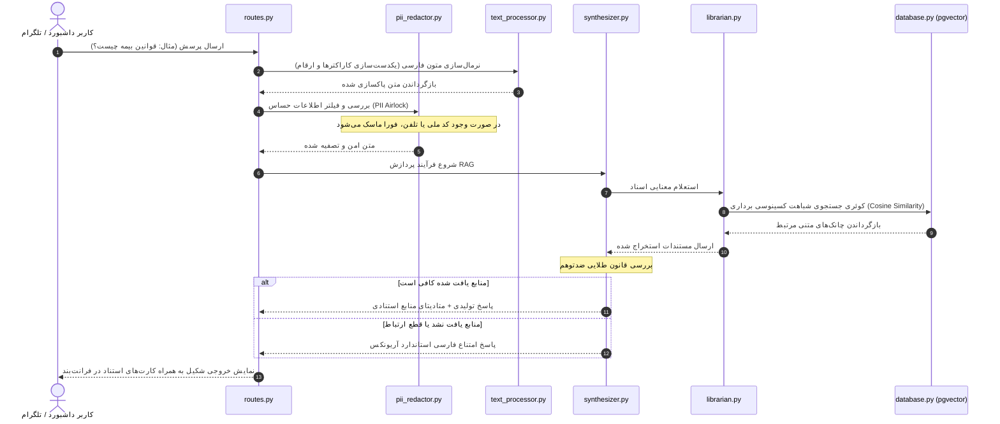

# راهنمای فنی توسعه‌دهندگان آریونکس (ArioNex Developer & Architecture Guide)

به سند راهنمای فنی توسعه‌دهندگان دستیار هوشمند سازمانی **آریونکس (ArioNex)** خوش آمدید. هدف از این سند، تشریح کامل معماری نرم‌افزار، ساختار دایرکتوری‌ها، جریان داده، پایگاه داده، الگوهای کدنویسی و روش‌های دیباگ و توسعه ماژول‌های جدید برای دولوپرها و مهندسان نرم‌افزار است.

---

## 🏛️ ۱. ساختار دایرکتوری‌ها و چیدمان ماژول‌ها (Repository Layout)

پروژه به دو بخش کاملاً مجزای بک‌بند (پایتون/FastAPI) و فرانت‌بند (جاوااسکریپت/React) تقسیم شده است:

```text
e:\ario\
├── backend/                        # هسته پردازشی بک‌بند (FastAPI)
│   ├── app/
│   │   ├── core/                   # تنظیمات سیستمی، دیتابیس و کلاینت‌ها
│   │   │   ├── config.py           # لودر تنظیمات Pydantic و YAML فیچرها
│   │   │   ├── database.py         # مدیریت کانکشن پستگرس و الگوهای SQLAlchemy
│   │   │   ├── logging.py          # مدیریت لاگ‌ها به صورت ساختاریافته انگلیسی
│   │   │   └── minio_client.py     # کلاینت استوریج به همراه سیستم فایل محلی پشتیبان
│   │   ├── endpoints/
│   │   │   └── routes.py           # روترها و کنترلرهای نقاط اتصال REST API
│   │   ├── services/               # ماژول‌های پردازش و عامل‌های هوش مصنوعی
│   │   │   ├── safety/
│   │   │   │   └── pii_redactor.py # فیلتر حریم شخصی و ماسک‌گذاری PII
│   │   │   └── workers/
│   │   │       ├── text_processor.py# نرمال‌ساز و چانک‌ساز لغزان متون فارسی
│   │   │       ├── unstructured.py # موتور پارس اسناد PDF/Word/Text
│   │   │       ├── analyst.py      # عامل محاسباتی LangGraph و مفسر ریاضی تراکنش‌ها
│   │   │       ├── librarian.py    # عامل کتابدار RAG جهت سرچ دیتابیس برداری
│   │   │       ├── support_lead.py # عامل ارزیاب انطباق چت با دانش سازمانی
│   │   │       └── synthesizer.py  # ترکیب‌کننده نهایی نتایج و موتور ضدتوهم
│   │   └── main.py                 # فایل اصلی راه‌اندازی FastAPI و مدیریت چرخه حیات
│   ├── Dockerfile                  # کانتینر بک‌بند بر پایه python:3.11-slim
│   ├── requirements.txt            # کتابخانه‌های مورد نیاز پایتون
│   └── config.yaml                 # پیکربندی پیش‌فرض فیچر تاگل‌های سرویس‌ها
│
├── frontend/                       # رابط کاربری وب (Vite + React)
│   ├── src/
│   │   ├── assets/                 # لوگوها و تصاویر ایستا
│   │   ├── App.jsx                 # بدنه اصلی داشبورد، صفحات، هوک‌ها و منطق اتصالات
│   │   ├── App.css                 # استایل‌های اختصاصی چت، سایدبار و پیش‌نمایش PII
│   │   ├── index.css               # سیستم طراحی و پالت‌های رنگی سورمه‌ای-مسی
│   │   └── main.jsx                # نقطه ورود React به فایل HTML
│   ├── Dockerfile                  # بیلد ۲ مرحله‌ای مدرن به همراه وب‌سرور Nginx
│   ├── nginx.conf                  # تنظیمات وب‌سرور Nginx جهت مسیریابی SPA
│   └── package.json                # وابستگی‌ها و پکیج‌های ری‌اکت
│
├── tests/                          # سناریوهای آزمون‌های خودکار و کنترل کیفیت
│   ├── test_phase2.py              # ارزیابی امنیت PII و پردازش متن
│   ├── test_phase3.py              # ارزیابی پارس متون اداری و مالی pandas
│   ├── test_phase4.py              # ارزیابی عامل‌های RAG و موتور ضدتوهم
│   ├── test_phase5.py              # ارزیابی درگاه‌های خروجی (REST، ربات تلگرام، ویجت)
│   └── test_phase7.py              # اجراکننده متمرکز و زنجیره‌ای کل تست‌ها
│
└── docker-compose.yml              # ارکستریشن کل شبکه کانتینری آریونکس
```

---

## 🛠️ ۲. چرخه حیات درخواست و جریان داده در بک‌بند (Data & Control Flow)

هنگامی که یک درخواست به `/v1/query` ارسال می‌شود، چرخه پردازش زیر به صورت کاملاً ناهمگام (Async) طی می‌شود:



---

## 💾 ۳. ساختار داده‌ها و مدل‌های پایگاه داده (PostgreSQL Database Schema)

در طراحی جداول دیتابیس در فایل `backend/app/core/database.py` از ORM محبوب SQLAlchemy به صورت Async استفاده شده است. اکستنشن `pgvector` جهت جستجوهای برداری فعال است:

### ۱. جدول اسناد پردازش شده (`pg_supervisor`)
جهت نگهداری اسناد خرد شده و بردارهای متناظر با آن‌ها:
* **`id`** (UUID, Primary Key)
* **`doc_name`** (String) - نام فیزیکی فایل.
* **`doc_text`** (Text) - متن چانک/قطعه استخراج شده.
* **`doc_embedding`** (Vector(1536)) - بردار معنایی تولید شده توسط مدل Embedding.
* **`meta_page`** (Integer) - شماره صفحه در فایل اصلی.
* **`created_at`** (DateTime) - زمان بارگذاری.

### ۲. جدول قالب‌های پرسش و پاسخ QnA (`qna_query`)
برای نگهداری قالب‌های FAQ سازمانی:
* **`id`** (Integer, Primary Key)
* **`question`** (String) - سوال مرجع سازمان.
* **`answer`** (Text) - پاسخ استاندارد تایید شده.
* **`embedding`** (Vector(1536)) - بردار سوال جهت تطبیق سریع.

### ۳. جدول گزارش حسابرسی امنیت حریم خصوصی (`pg_audit_logs`)
جهت لاگ‌نویسی اقدامات سانسور PII:
* **`id`** (Integer, Primary Key)
* **`file_name`** (String) - نام فایل پردازش شده.
* **`redacted_count`** (Integer) - تعداد موارد سانسور شده در فایل.
* **`redaction_details`** (JSON) - جزئیات المان‌های سانسور شده به صورت دسته‌بندی‌شده (کد ملی، ایمیل و...).
* **`timestamp`** (DateTime) - زمان دقیق رویداد.

---

## 🔒 ۴. اصول کدنویسی، لاگ‌نویسی و استانداردهای توسعه (Coding Guidelines)

جهت حفظ یکپارچگی کدها توسط تمامی دولوپرها، رعایت قوانین زیر الزامی است:

1. **قانون زبان کامنت‌ها و مستندات کد:**
   * تمامی توضیحات، کامنت‌ها و داک‌استرینگ‌های درون فایل‌های پایتون و ری‌اکت باید به زبان **فارسی روان و با فرمت ساختاریافته XML/C#** نوشته شوند.
   * نمونه استاندارد:
     ```python
     def chunk_text(text: str) -> list[str]:
         """
         /// <summary>
         /// شکستن متون فارسی به چانک‌های معنایی لغزان
         /// </summary>
         /// <param name="text">متن فارسی ورودی</param>
         /// <returns>لیستی از قطعات متنی جداشده</returns>
         """
         # پیاده‌سازی منطق چانک‌سازی
         pass
     ```

2. **قانون زبان لاگ‌ها و پیام‌های خطا (Error Logs):**
   * تمامی لاگ‌های ثبت شده در سیستم توسط ماژول `logging.py` و پیام‌های خطای سرور در کنسول یا فایل لاگ باید کاملاً به زبان **انگلیسی** ثبت گردند تا فرآیند پایش و ابزارهای مانیتورینگ سرور دچار مشکل رندر کاراکترها نشوند.

3. **مدیریت ایمن کلیدها و حالت آفلاین (Mock Mode):**
   * سیستم باید به صورت مستقل و بدون وابستگی شدید به کلیدهای API کار کند. کلاینت Embedding در فایل `backend/app/services/workers/text_processor.py` در صورت عدم وجود کلید OpenAI در متغیرهای محیطی، به صورت خودکار به حالت **Mock Zero-Embeddings** تغییر وضعیت می‌دهد تا فرآیند تست و اجرای آفلاین هرگز با شکست مواجه نشود.

---

## 🛠️ ۵. روش‌های راه‌اندازی محلی، تست و دیباگ (Local Running & Debugging)

### الف) راه‌اندازی سریع محیط محلی توسعه بک‌بند
1. ایجاد یک محیط مجازی پایتون:
   ```bash
   cd backend
   python -m venv venv
   .\venv\Scripts\activate   # در ویندوز
   source venv/bin/activate  # در لینوکس
   ```
2. نصب پکیج‌های مورد نیاز به همراه multipart:
   ```bash
   pip install -r requirements.txt
   pip install python-multipart
   ```
3. اجرای سرور FastAPI در حالت توسعه زنده:
   ```bash
   uvicorn app.main:app --host 127.0.0.1 --port 8000 --reload
   ```

### ب) راه‌اندازی سریع محیط محلی توسعه فرانت‌بند
1. ورود به پوشه و نصب وابستگی‌های Node.js:
   ```bash
   cd frontend
   npm install
   ```
2. اجرای سرور توسعه Vite:
   ```bash
   npm run dev
   ```
   برنامه در آدرس `http://localhost:5173` بالا می‌آید و به بک‌بند در پورت ۸۰۰۰ متصل می‌شود.

### ج) نحوه دیباگ و اجرای تست‌های خودکار
پیش از ارسال هرگونه پول‌ریکوئست (PR) یا کامیت جدید، اجرای تست تجمیعی نهایی جهت بررسی عدم بروز پس‌رفت (Regression) در عملکرد سیستم اجباری است:
```powershell
$env:PYTHONIOENCODING="utf-8"
python tests/test_phase7.py
```
اگر تمامی تست‌ها پاس شدند، تغییرات شما بدون آسیب به هسته سیستم اعمال شده‌اند.

---

## ➕ ۶. راهنمای گام‌به‌گام افزودن یک سرویس جدید (How to Add a Service)

برای افزودن یک کارگر یا سرویس پردازشی جدید به آریونکس، گام‌های زیر را طی کنید:

1. **تعریف فیچر تاگل در `config.yaml`:**
   سرویس جدید خود را با یک کلید به بخش سرویس‌های فعال اضافه کنید:
   ```yaml
   services:
     new_expert_worker: false  # به صورت پیش‌فرض خاموش
   ```
2. **پیاده‌سازی ماژول سرویس در `services/workers/`:**
   یک فایل پایتون با نام `new_worker.py` بسازید و متدها را به همراه کامنت‌های فارسی پیاده‌سازی کنید.
3. **اتصال به تنظیمات داینامیک:**
   در کد خود وضعیت روشن بودن فیچر را از شیء `settings.services.new_expert_worker` استعلام کرده و در صورت روشن بودن، پردازش را فراخوانی کنید.
4. **اتصال به داشبورد ادمین فرانت‌بند:**
   در فایل `frontend/src/App.jsx` کلید تاگل متناظر را به بخش تنظیمات ادمین اضافه کنید تا مدیر سیستم بتواند آن را از پنل کاربری خاموش یا روشن کند.
