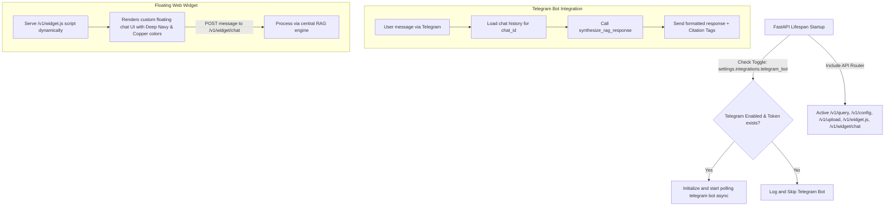

# طرح فنی پیاده‌سازی فاز ۵: درگاه‌های ارتباطی و ادغام‌های چندگانه (Omni-Channel Integration)

این سند شامل جزئیات فنی و مراحل پیاده‌سازی دقیق **فاز ۵** دستیار هوشمند سازمانی **آریونکس (ArioNex)** است. در این فاز، زیرساخت ارتباطی یکپارچه دستیار با سازمان‌ها از طریق سه کانال مجزا (REST API، ربات تلگرام سازمانی و ابزارک چت شناور وب‌سایت) برقرار می‌گردد.

---

## User Review Required

> [!IMPORTANT]
> برای راه‌اندازی و اجرای پایدار ربات تلگرام در محیط ایران و ممانعت از کرش وب‌سرور FastAPI در زمان خطاهای احتمالی شبکه یا توکن نامعتبر، تمهیدات زیر اندیشیده شده است:
> 
> ۱. **اجرای کاملاً ناهمگام (Async Non-blocking):** ربات تلگرام با استفاده از متدهای اصولی `initialize()`, `start()` و `updater.start_polling()` به طور کاملاً بومی و ناهمگام در حلقه رویدادهای (Lifespan Event Loop) وب‌سرور FastAPI اجرا می‌شود تا نیازی به ساخت ترد (Thread) اضافه و بار اضافی پردازنده نباشد.
> ۲. **مدیریت شکست ایمن (Graceful Failure Management):** در صورت نامعتبر بودن توکن یا قطع اتصال شبکه/پروکسی، ربات به طور خودکار خطای مربوطه را به صورت انگلیسی لاگ می‌کند اما از بالا آمدن وب‌سرور FastAPI جلوگیری نخواهد کرد.
> ۳. **مدیریت نشست‌های چت تلگرام (Session Store):** برای هر کاربر بر اساس شناسه منحصربه‌فرد `chat_id` یک حافظه نشست محلی در نظر گرفته می‌شود تا ربات بتواند با خواندن پیام‌های قبلی، ابهامات را برطرف نموده و به صورت RAG با تاریخچه هوشمند پاسخ دهد.

---

## Open Questions

> [!NOTE]
> هیچ سوال بازی برای این فاز وجود ندارد. تمام الزامات و استانداردهای طراحی پالت رنگی (سرمه‌ای و مسی) و قانون طلایی عدم توهم RAG کاملاً مشخص و شفاف است. در صورت تمایل کاربر به استفاده از پروکسی تلگرام، متغیرهای استاندارد پروکسی نیز در کد ربات پیش‌بینی خواهند شد.

---

## Proposed Changes

در این فاز، تغییرات زیر در لایه‌های بک‌اند، سیستم ادغام‌ها و پوشه تست‌ها اعمال خواهد شد:



---

### [Component: Integrations & API Core]

توسعه زیرسیستم ربات تلگرام، اسکریپت جاوااسکریپت ابزارک پاپ‌آپ و ویرایش نقاط اتصال در وب‌سرور اصلی.

#### [NEW] [telegram_bot.py](file:///e:/ario/backend/app/services/integrations/telegram_bot.py)
* پیاده‌سازی ربات تلگرام سازمانی با استفاده از نسخه مدرن `python-telegram-bot` به صورت ناهمگام.
* بررسی تنظیمات `settings.integrations.telegram_bot` پیش از اقدام به اتصال.
* مدیریت خطاهای اتصال و توکن‌های خالی با مکانیزم Try-Except جهت ثبات صددرصدی وب‌سرور بک‌اند.
* مدیریت پویای سشن تاریخچه چت بر اساس شناسه عددی تلگرام (`chat_id`) کاربران جهت ادغام با زنجیره رفع ابهام RAG.
* ارسال پاسخ نهایی فارسی به همراه تگ‌های دقیق منابع و استنادات.

#### [MODIFY] [endpoints.py](file:///e:/ario/backend/app/api/endpoints.py)
* تعریف اندپویند `/v1/widget.js` جهت بازگرداندن داینامیک و فشرده اسکریپت ابزارک وب با هدر مناسب `application/javascript`.
* پیاده‌سازی اندپوینت ارتباطی ویژه ابزارک پاپ‌آپ `/v1/widget/chat` برای دریافت ورودی‌ها و بازگرداندن پاسخ‌های RAG در تم مجلل آریونکس.
* افزودن دایرکتوری و سشن‌های تستی برای تست روان فرانت‌اند و سیستم‌های خارجی.

#### [MODIFY] [main.py](file:///e:/ario/backend/app/main.py)
* وارد کردن و ثبت روتر اندپوینت‌های آریونکس با دستور `app.include_router(router)`.
* اتصال وقایع راه‌اندازی و متوقف کردن ربات تلگرام سازمانی در چرخه حیات `lifespan` وب‌سرور FastAPI.

---

### [Component: Quality Assurance & Testing]

تضمین صحت عملکرد صددرصدی تمام اندپوینت‌ها و ماژول‌ها بدون شکست در فرآیندهای گیت‌هاب و محیط لوکال.

#### [NEW] [test_phase5.py](file:///e:/ario/tests/test_phase5.py)
* بررسی دقیق اتصالات REST API شامل تست ریکوئست‌های `/v1/query` و `/v1/config` و `/v1/widget/chat`.
* شبیه‌سازی (Mocking) درخواست‌های ربات تلگرام جهت اطمینان از عملکرد عالی مدیریت مکالمه‌ها و پردازش کلمات.
* اعتبارسنجی استناد به اسناد و رفتار عدم توهم (Non-Hallucination) در ورودی‌های جدید فاز ۵.

---

## Verification Plan

### Automated Tests
برای اجرای تست‌های خودکار فاز ۵ و اطمینان از صحت کامل فرآیندها، دستورات زیر در محیط PowerShell ویندوز اجرا خواهند شد:
```powershell
# فعال‌سازی یونیکد فارسی برای خروجی‌های ترمینال ویندوز
$env:PYTHONIOENCODING="utf-8"

# اجرای تست‌های فاز ۵
python -m pytest tests/test_phase5.py -v
```

### Manual Verification
* **بررسی رابط چت ابزارک:** باز کردن فایل متنی HTML در مرورگر و لود کردن اسکریپت `http://localhost:8000/v1/widget.js` جهت اطمینان از بالا آمدن چت‌باکس شناور با تم کلاسیک آریونکس (سرمه‌ای تیره `#0f1a2e` و مسی `#c4894a`).
* **شبیه‌سازی ارتباط ربات تلگرام:** بررسی رفتار لاگ‌ها و اطمینان از مقداردهی درست توکن و لود شدن کنترلر ربات در زمان اجرای برنامه.
