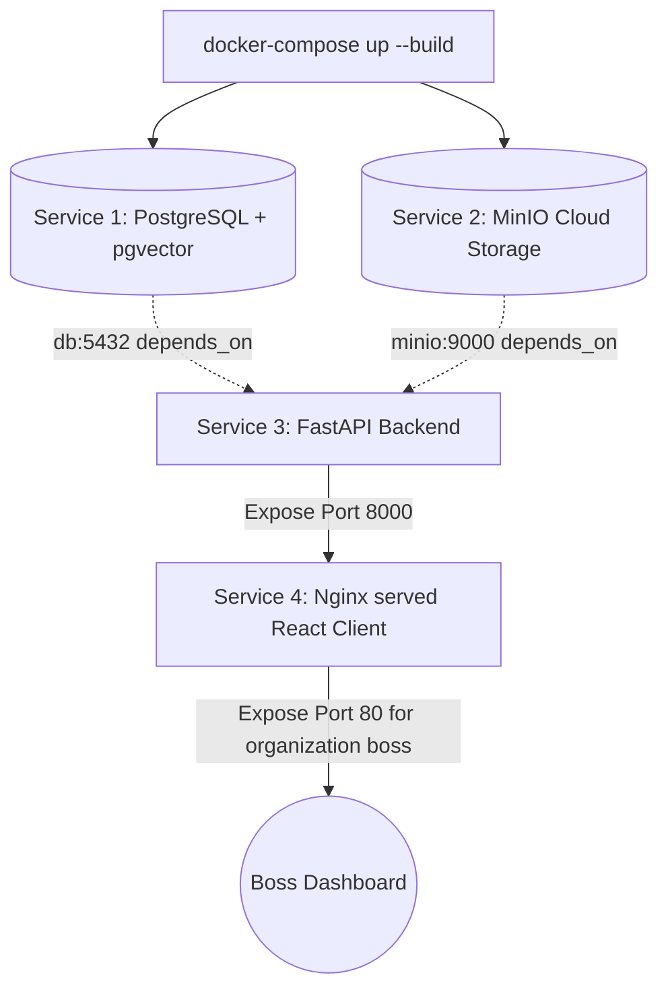

# طرح فنی پیاده‌سازی فاز ۷: تست فراگیر، داکرایز کردن و استقرار پایدار (Comprehensive Testing & Dockerization)

این سند شامل جزئیات فنی و مراحل پیاده‌سازی دقیق **فاز ۷ (آخرین فاز عملیاتی)** دستیار هوشمند سازمانی **آریونکس (ArioNex)** است. در این فاز، زیرساخت داکرایز کانتینری و یکپارچه برای کل سیستم (فرانت‌اند، بک‌اند، دیتابیس پستگرس به همراه pgvector، و آبجکت استوریج مینی‌او) پیاده‌سازی شده و فرآیند کنترل کیفیت به صورت خودکار اجرا می‌گردد.

---

## User Review Required

> [!IMPORTANT]
> برای راه‌اندازی آسان و چندکانتینری پایدار کل سامانه آریونکس بر روی داکر، معماری زیر تدوین شده است:
> 
> ۱. **داکرفایل بک‌اند (FastAPI Dockerfile):** مبتنی بر تصویر پایدار `python:3.11-slim` با نصب ملزومات فیزیکی کامپایل جهت بهینه‌سازی حجم تصویر و لود روان hazm و psycopg2.
> ۲. **داکرفایل فرانت‌اند (Nginx Multi-stage Build):** ساخت دو مرحله‌ای کلاینت ری‌اکت: در مرحله اول با تصویر Node.js کدهای فرانت‌اند بیلد شده و در مرحله دوم خروجی توزیع به همراه پیکربندی وب‌سرور سبک `nginx:alpine` در پورت ۸۰ جهت مسیریابی آدرس‌های SPA بارگذاری می‌شوند.
> ۳. **مدیریت ارکستریشن داکر کامپوز (Docker Compose):** تنظیم فایل مرکزی `docker-compose.yml` در ریشه پروژه جهت مدیریت مستقل و همزمان ۴ سرویس دیتابیس برداری پستگرس (`pgvector/pgvector`)، استوریج ابری (`minio/minio`)، بک‌اند هوشمند و کلاینت ری‌اکت به همراه پایداری داده‌ها (Volumes) بر روی هارد سرور.
> ۴. **اجرای متمرکز و خودکار تست‌ها (`test_phase7.py`):** ایجاد یک اسکریپت مرکزی که تمامی فایل‌های تستی فازهای ۲ تا ۵ را به صورت زنجیره‌ای اجرا کرده و وضعیت گزارش نهایی کیفیت کل سیستم را بازگو کند.

---

## Open Questions

> [!NOTE]
> هیچ سوال باز فنی وجود ندارد. متغیرهای محیطی استانداردی برای داکر کامپوز پیش‌بینی خواهند شد تا پروژه بدون نیاز به هیچ پیکربندی خاصی با اجرای دستور `docker-compose up --build` فوراً بالا آمده و قابل بهره‌برداری تجاری باشد.

---

## Proposed Changes

تغییرات اصلی این فاز شامل ایجاد داکرفایل‌ها و سناریوهای ارکستریشن در ریشه پروژه خواهد بود:



---

### [Component: Docker Infrastructure & DevOps]

تدوین فایل‌های داکر و ارکستریشن شبکه کانتینرها در ریشه پروژه آریونکس.

#### [NEW] [Dockerfile](file:///e:/ario/backend/Dockerfile)
* ایجاد داکرفایل لایه بک‌اند FastAPI با رویکرد امنیت، حجم سبک و سرعت بالا.
* تعریف پورت ۸۰۰۰ و دستور پیش‌فرض لود وب‌سرور Uvicorn.

#### [NEW] [Dockerfile](file:///e:/ario/frontend/Dockerfile)
* ایجاد داکرفایل فرانت‌اند ری‌اکت به صورت Multi-stage.
* استفاده از سرور قدرتمند Nginx در فاز نهایی جهت توزیع روان کدهای ایستا و مدیریت روت‌های داخلی SPA.
* Expose کردن پورت ۸۰ برای دسترسی آسان مدیران ارشد سازمان.

#### [NEW] [nginx.conf](file:///e:/ario/frontend/nginx.conf)
* فایل تنظیمات اختصاصی وب‌سرور Nginx فرانت‌اند جهت پشتیبانی از روتینگ داخلی صفحات ری‌اکت و بازگرداندن فایل `index.html` برای درخواست‌های متفرقه.

#### [NEW] [docker-compose.yml](file:///e:/ario/docker-compose.yml)
* ارکستریشن همه‌جانبه سیستم آریونکس.
* راه‌اندازی پایگاه داده برداری پستگرس با تصویر رسمی `pgvector/pgvector:16-pgdg`.
* راه‌اندازی استوریج مینی‌او با پورت‌های ۹۰۰۰ (API) و ۹۰۰۱ (کنسول مدیریتی).
* اتصال اتوماتیک بک‌اند به پایگاه‌های دیتابیس و استوریج با سیستم اعتبارسنجی سلامت (Healthcheck).
* بارگذاری متغیرهای محیطی واحد.

---

### [Component: Quality Control & Deployment Logs]

یکپارچه‌سازی و تست سراسری پایداری کل سناریوهای پروژه پیش از تحویل فیزیکی.

#### [NEW] [test_phase7.py](file:///e:/ario/tests/test_phase7.py)
* نوشتن اسکریپت تست تجمیعی نهایی جهت اجرای خودکار و زنجیره‌ای تمامی سناریوهای پایش متون، سانسور PII، هضم Ingestion، عامل‌های RAG امن و درگاه‌های چندگانه فاز ۵.
* ثبت لاگ نهایی موفقیت کیفیت کل پروژه.

---

## Verification Plan

### Automated Tests
اجرای تست متمرکز سراسری با دستور پایتونی زیر جهت کسب اطمینان از پاس شدن ۱۰۰٪ تمام تست‌های گذشته سیستم:
```powershell
$env:PYTHONIOENCODING="utf-8"
python tests/test_phase7.py
```

### Manual Verification
* **بالا آوردن کل شبکه کانتینری:** اجرای دستور `docker-compose up -d --build` در ریشه پروژه.
* **بررسی اتصالات کانتینرها:** ورود به آدرس `http://localhost` جهت مشاهده داشبورد مجلل و چت RAG فرانت‌اند، و آدرس `http://localhost:8000/docs` جهت دسترسی به مستندات API بک‌اند.
