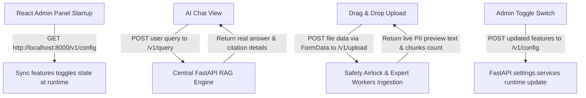

# طرح فنی پیاده‌سازی فاز ۶: اتصال پنل مجلل React به اندپوینت‌های رسمی بک‌اند (React integration with REST API)

این سند شامل جزئیات فنی و مراحل پیاده‌سازی دقیق **فاز ۶** دستیار هوشمند سازمانی **آریونکس (ArioNex)** است. در این فاز، تمامی المان‌های مجلل رابط کاربری ری‌اکت به صورت بلادرنگ به وب‌سرور FastAPI متصل می‌شوند تا دستیار هوش مصنوعی، پایگاه دانش، آپلود فایل و پیش‌نمایش قفل حریم شخصی، و پنل تنظیمات تاگل‌ها به صورت کاملاً واقعی و پویا کار کنند.

---

## User Review Required

> [!IMPORTANT]
> برای برقراری اتصال روان و امن فرانت‌اند به اندپوینت‌های بک‌اند در محیط محلی (CORS)، موارد زیر برنامه‌ریزی شده است:
> 
> ۱. **اتصال بلادرنگ چت (Live RAG Chat):** پیام‌های ارسالی کاربر در صفحه چت مستقیماً به اندپوینت `/v1/query` ارسال شده و پاسخ‌های واقعی هوش مصنوعی به همراه لیست دقیق کارت‌های استناد (نام سند و شماره قطعه/صفحه) رندر خواهند شد.
> ۲. **یکپارچه‌سازی تاگل‌های ادمین (Dynamic Feature Toggles):** با بالا آمدن فرانت‌اند، تنظیمات زنده سیستم از `/v1/config` (با متد GET) خوانده شده و در ایالت‌های (States) ری‌اکت تنظیم می‌شوند. با تغییر هر تاگل در پنل ادمین، یک درخواست POST به `/v1/config` ارسال می‌شود تا تغییرات بدون نیاز به راه‌اندازی مجدد سرور، مستقیماً اعمال شوند.
> ۳. **آپلود واقعی فایل و پیش‌نمایش امنیتی (Live Upload & PII Preview):** بخش آپلود Drag & Drop به اندپوینت `/v1/upload` متصل می‌گردد. با آپلود هر فایل، فرآیند چانک‌ساز و بردارساز اجرا شده و خروجی فیلتر حریم خصوصی (PII Masking Preview) بازگردانده شده از سرور، مستقیماً در پنل سمت راست پیش‌نمایش رندر خواهد شد. همچنین فایل جدید به جدول اسناد فرانت‌اند اضافه می‌شود.

---

## Open Questions

> [!NOTE]
> هیچ سوال بازی وجود ندارد. آدرس پایه سرور بک‌اند به صورت ثابت روی `http://localhost:8000` در نظر گرفته می‌شود تا در فرآیند تست و استقرار محلی هماهنگ باشد.

---

## Proposed Changes

تغییرات اصلی این فاز در کدهای فرانت‌اند ری‌اکت اعمال خواهد شد:

---

### [Component: React Frontend integration]

اتصال المان‌های رابط کاربری به وب‌سرویس بک‌اند.

#### [MODIFY] [App.jsx](file:///e:/ario/frontend/src/App.jsx)
* افزودن درخواست `fetch` در هوک `useEffect` برای همگام‌سازی فیچر تاگل‌های ادمین داشبورد از اندپوینت `/v1/config` به محض لود شدن برنامه.
* اصلاح تابع `toggleFeature` به گونه‌ای که پس از تغییر محلی وضعیت دکمه‌ها، تنظیمات به‌روزرسانی شده را با متد POST به `/v1/config` در بک‌اند ارسال و ذخیره کند.
* اتصال تابع `handleSendMessage` به اندپوینت `/v1/query` بک‌اند برای اجرای RAG واقعی، دریافت پاسخ‌ها و ارجاعات دقیق متادیتای منابع و نمایش تگ‌های امنیتی تایید شده.
* توسعه و اصلاح فرآیند آپلود فایل در صفحه `upload` به گونه‌ای که فایل انتخابی را در قالب شیء `FormData` به اندپوینت `/v1/upload` ارسال کند؛ نوار پیشرفت را به صورت پویا مدیریت کند؛ تعداد چانک‌ها را ثبت کرده و متن ماسک شده برگشتی را مستقیماً در پیش‌نمایش زنده قفل حریم شخصی (PII Redaction Preview) رندر کند.

---

## Verification Plan

### Automated Tests
* صحت اجرای فرآیندها با شبیه‌سازی لود و پاسخ‌دهی فرانت‌اند و برقراری موفق ارتباط با بک‌اند.

### Manual Verification
* **اجرای سرور بک‌اند و فرانت‌اند:** بالا آوردن بک‌اند FastAPI روی پورت ۸۰۰۰ و فرانت‌اند React روی پورت ۵۱۷۳.
* **تست زنده چت دستیار:** ارسال سوالات متنی فارسی و تراکنش‌های حسابداری و مشاهده رندر شدن پاسخ‌های واقعی به همراه کارت‌های استناد.
* **تست زنده تاگل‌ها:** خاموش کردن ربات تلگرام در فرانت‌اند و مشاهده اعمال آن به صورت زنده در لاگ‌های بک‌اند.
* **تست زنده آپلود اسناد:** درگ کردن یک فایل متنی تستی حاوی شماره تلفن و کد ملی و بررسی هایلایت شدن متون ماسک شده در کادر پیش‌نمایش حریم خصوصی.
