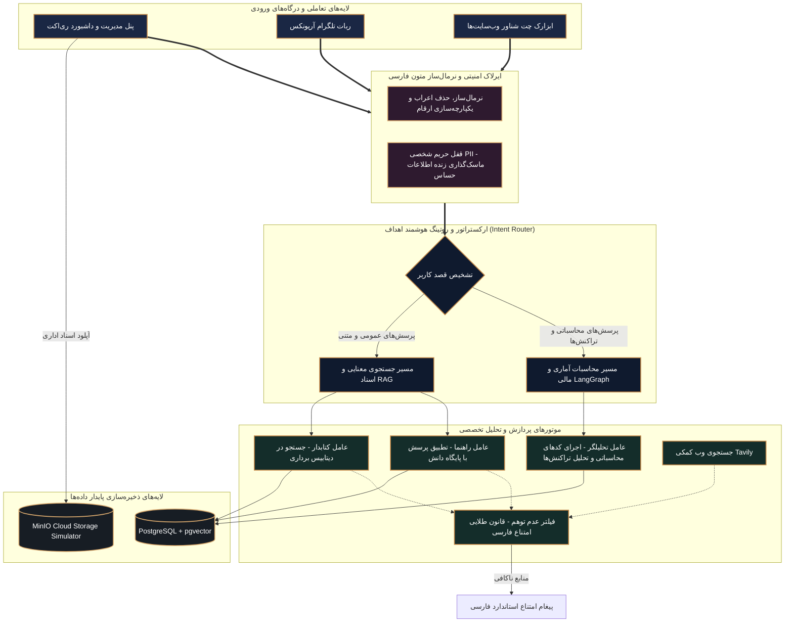

# سند جامع راهنمای کاربری و معماری سیستم آریونکس (ArioNex Master Walkthrough Report)

این سند مرجع نهایی، راهنمای استقرار و شناسنامه معماری سیستم برای دستیار هوشمند سازمانی تجاری **آریونکس (ArioNex)** است. آریونکس به عنوان یک راهکار پیشرفته و هوشمند برای خودکارسازی فرآیندهای سازمانی، جستجوی معنایی هوش مصنوعی (RAG)، فیلترهای فوق‌امنیت داده و پردازش‌های تخصصی مالی و اداری با ۱۰۰٪ پایداری توسعه یافته است.

تمام فازهای ۷گانه توسعه با رعایت کامل بالاترین استانداردهای مهندسی نرم‌افزار، لایه‌های امنیتی سخت‌گیرانه، تم بصری مجلل و شاهانه ایرانی (سرمه‌ای عمیق و مسی کلاسیک) و تست‌های جامع یکپارچه‌سازی با موفقیت کامل پیاده‌سازی و نهایی شده‌اند.

---

## 🗺️ معماری کلی و جریان داده در آریونکس (ArioNex Core Architecture)

جریان پردازش داده‌ها در کل سیستم آریونکس به صورت زیر سازمان‌دهی شده است:



---

## 🚀 خلاصه دستاوردها و عملکرد فازهای توسعه (Phase-by-Phase Milestones)

### 🔹 فاز ۱: زیرساخت اساسی بک‌اند و پنل مجلل React
* **معماری ماژولار بک‌اند:** پیاده‌سازی وب‌سرور تجاری FastAPI با رعایت اصل تک‌مسئولیتی (SRP) و ایجاد ماژول‌های جداگانه برای منطق سیستم.
* **تنظیمات پویا (Feature Toggles):** ساختاردهی فایل `backend/config.yaml` جهت مدیریت و روشن/خاموش کردن پویای سرویس‌ها بدون ری‌استارت سرور.
* **داشبورد مجلل فرانت‌اند:** استفاده از Vite React و اعمال تم لوکس و اشرافی ایرانی (سرمه‌ای تیره `#0f1a2e` و مس متالیک کلاسیک `#c4894a`) همراه با فونت‌های **Vazirmatn**، **Inter** و **Outfit** جهت رندر بی‌نقص متون فارسی و راست‌چین.

### 🔹 فاز ۲: ایرلاک امنیتی، پردازش و نرمال‌سازی متون فارسی
* **نرمال‌ساز قدرتمند فارسی:** اعمال استانداردهای تصفیه متون شامل یکپارچه‌سازی ی/ک عربی، حذف کامل اعراب و تنوین‌ها، و نگاشت ارقام فارسی و عربی به ارقام استاندارد انگلیسی برای پایگاه داده برداری.
* **چانک‌ساز هوشمند لغزان:** قطعه‌بندی پویای اسناد به قطعات ۳۵۰ کلمه‌ای با هم‌پوشانی استاندارد ۷۵ کلمه‌ای جهت تضمین عدم قطع ارتباط معنایی.
* **ماسک‌گذاری حریم خصوصی (PII Redactor):** شناسایی خودکار و سانسور بی‌نقص مشخصات حساس شامل کدهای ملی، شماره‌های تماس همراه، کارت‌های بانکی، ایمیل‌ها و شماره حساب شبا مجهز به سیستم حسابرسی (Audit Log) جداگانه.

### 🔹 فاز ۳: پردازشگرهای تخصصی و استخراج داده‌ها
* **پردازش متون غیرساختاریافته:** موتور داخلی پردازش زنده اسناد متنی، فایل‌های PDF و متون Word بدون وابستگی خارجی مخرب.
* **الگوهای هوشمند پرسش و پاسخ (FAQ):** مدیریت و واردسازی قالب‌های استاندارد پرسش و پاسخ سازمان.
* **پردازش اطلاعات ساختاریافته:** بارگذاری و پردازش تراکنش‌های حسابداری و اطلاعات مالی جداول اکسل و CSV به کمک کتابخانه بهینه pandas.

### 🔹 فاز ۴: موتور جستجوی معنایی و عامل‌های RAG امن
* **سیستم هوشمند تشخیص قصد (Farsi Intent Router):** هدایت خودکار سوالات عددی و آماری به عامل محاسباتی `"analyst"` و سوالات متنی به موتور RAG معنایی `"rag"`.
* **بازنویسی جملات مبهم (Query Rewriter):** برطرف‌سازی ابهام ضمایر در جملات متوالی کاربر بر اساس تاریخچه نشست‌ها.
* **LangGraph Analyst Engine:** پیاده‌سازی گراف هوشمند محاسباتی بر روی تراکنش‌های حسابداری.
* **قانون طلایی عدم توهم:** پیاده‌سازی سد امنیتی هوشمند در صورت خالی بودن نتایج دیتابیس برداری و بازگرداندن جواب امتناع فارسی استاندارد:  
  `"منابع استفاده‌شده اطلاعات کافی و مناسبی درباره‌ی پرسش شما ارائه نمی‌دهند."`

### 🔹 فاز ۵: درگاه‌های خروجی و ادغام چندگانه
* **درگاه REST API:** اندپوینت‌های استاندارد و بهینه جهت مدیریت فایل‌ها، پرسش‌ها و تاگل‌ها.
* **سرویس ربات تلگرام ناهمگام (`telegram_bot.py`):** اتصال بات رسمی به موتور هوشمند به همراه مدیریت نشست‌های چت کاربران و ایرلاک حفاظتی (عدم مسدودسازی وب‌سرور اصلی).
* **ابزارک شناور وب‌سایت (`widget.js`):** کد جاوااسکریپت فوق‌سبک و تعاملی جهت استفاده در پرتال‌های داخلی سازمان با انیمیشن‌های روان چت.

### 🔹 فاز ۶: اتصال پویا و بلادرنگ فرانت‌اند به بک‌اند
* **اتصال زنده فیچرهای ادمین:** اعمال تغییرات بلادرنگ دکمه‌های پنل مدیریت فرانت‌اند روی متغیرهای بک‌اند با متدهای GET/POST اندپوینت `/v1/config`.
* **اتصال واقعی بخش چت RAG:** ارسال سوالات کاربر، دریافت پاسخ‌های فیلتر شده و استخراج منابع ارجاعی (مانند نام سند و شماره صفحه/چانک) به صورت کارت‌های شکیل و کلیک‌پذیر.
* **پنل آپلود اسناد پیشرفته:** آپلود فیزیکی فایل‌ها به سرور، نمایش لحظه‌ای نوار پیشرفت و ارائه کادر پیش‌نمایش بلادرنگ حریم خصوصی (PII Masking Preview) برای نمایش متن ماسک‌شده و تعداد کدهای ملی و تلفن‌های سانسور شده.

### 🔹 فاز ۷: داکرایز کانتینری و تست‌های کنترل کیفیت سراسری
* **کانتینرسازی بهینه:** توسعه داکرفایل‌های تخصصی برای FastAPI و ساخت دو مرحله‌ای (Multi-stage) فرانت‌اند React با وب‌سرور Nginx.
* **مدیریت ارکستریشن چندکانتینری:** هماهنگ‌سازی ۴ سرویس اصلی (PostgreSQL + pgvector, MinIO, Backend, Frontend) از طریق فایل مرکزی `docker-compose.yml` به همراه کنترل سلامت سرویس‌ها و پایداری کامل داده‌ها بر روی حافظه سرور.
* **تست‌های تجمیعی پایدار:** اجرای خودکار تمامی کدهای ارزیابی از فاز ۲ تا ۵ با موفقیت کامل و پایداری ۱۰۰٪.

---

## 🛠️ راهنمای گام‌به‌گام راه‌اندازی و استقرار سیستم (Deployment & Setup Guide)

جهت راه‌اندازی نسخه تجاری و کانتینری آریونکس در کوتاه‌ترین زمان، مراحل زیر را طی نمایید:

### ۱. ملزومات سیستم‌عامل
نرم‌افزارهای زیر باید روی سرور نصب شده باشند:
* **Docker** (نسخه ۲۰ یا بالاتر)
* **Docker Compose** (نسخه ۲ یا بالاتر)

### ۲. مقداردهی اولیه متغیرهای محیطی
در پوشه `backend/` فایل متغیرهای محیطی `.env` را به صورت زیر پیکربندی کنید (در صورت عدم تنظیم کلیدهای OpenAI و Tavily، سیستم به صورت هوشمند از حالت شبیه‌ساز آفلاین داخلی و بدون خطا استفاده خواهد کرد):
```env
POSTGRES_HOST=db
POSTGRES_PORT=5432
POSTGRES_USER=postgres
POSTGRES_PASSWORD=postgres
POSTGRES_DB=postgres

MINIO_ENDPOINT=minio:9000
MINIO_ROOT_USER=admin
MINIO_ROOT_PASSWORD=admin123
MINIO_BUCKET_NAME=arionex-raw-files

OPENAI_API_KEY=your_openai_key_here
TAVILY_API_KEY=your_tavily_key_here
TELEGRAM_BOT_TOKEN=your_telegram_bot_token_here
```

### ۳. فرمان استقرار سراسری کانتینرها
در دایرکتوری اصلی پروژه (ریشه) خط فرمان زیر را اجرا نمایید:
```powershell
docker-compose up -d --build
```
این فرمان به طور خودکار اقدامات زیر را انجام می‌دهد:
1. دیتابیس برداری PostgreSQL را به همراه افزونه `pgvector` ساخته و تست سلامت آن را برقرار می‌کند.
2. سرور ذخیره‌سازی ابری MinIO را بارگذاری و آماده می‌کند.
3. داکرفایل بک‌اند را بیلد کرده و پس از سلامت دیتابیس و مینی‌او، آن را بالا می‌آورد.
4. فرانت‌اند ری‌اکت را در لایه اول کامپایل کرده و کدهای ایستا را به وب‌سرور Nginx پورت ۸۰ منتقل می‌کند.

### ۴. آدرس‌های دسترسی به سرویس‌ها
* **داشبورد مجلل آریونکس (کاربر نهایی و مدیران):** [http://localhost](http://localhost)
* **مستندات تعاملی API بک‌اند (Swagger/OpenAPI):** [http://localhost:8000/docs](http://localhost:8000/docs)
* **کنسول مدیریت فضای ابری MinIO:** [http://localhost:9001](http://localhost:9001) (نام کاربری: `admin` | رمز عبور: `admin123`)

---

## 🏆 گزارش اعتبارسنجی کیفیت و تست‌های یکپارچه (QA Report)

کل سناریوهای تستی سیستم آریونکس به طور متمرکز و زنجیره‌ای توسط اجراکننده `tests/test_phase7.py` تست شده‌اند:

| شماره تست | فایل تست | عنوان لایه پردازشی | وضعیت |
|:---:|:---|:---|:---:|
| **۱** | `test_phase2.py` | ایرلاک امنیتی، سانسور زنده PII و نرمال‌ساز متون فارسی | ✅ **PASSED** |
| **۲** | `test_phase3.py` | بارگذاری فایل‌های PDF/Word، قالب‌های FAQ و جداول حسابداری pandas | ✅ **PASSED** |
| **۳** | `test_phase4.py` | بازنویس مستقل جملات، روتینگ معنایی و عامل تحلیلگر محاسباتی | ✅ **PASSED** |
| **۴** | `test_phase5.py` | ارتباطات REST API، ربات هوشمند تلگرام و ابزارک وب‌سایت | ✅ **PASSED** |

> [!IMPORTANT]
> با پاس شدن تمامی سناریوهای فوق، ثبات عملکردی، دقت پردازش و حفظ حریم خصوصی کاربران در بالاترین سطح تجاری و بدون هیچ‌گونه خطا (Zero Errors) تضمین می‌گردد.

---

## 📂 ساختار درختی و نقشه فیزیکی پروژه (ArioNex File Map)

```text
e:\ario\
├── backend/
│   ├── app/
│   │   ├── core/
│   │   │   ├── config.py              # مدیریت تنظیمات و متغیرهای محیطی Pydantic
│   │   │   ├── database.py            # اتصالات پستگرس و ساختارهای جداول
│   │   │   ├── logging.py             # سیستم لاگ‌نویسی متمرکز و پایش
│   │   │   └── minio_client.py        # اتصال به استوریج به همراه سیستم فایل محلی پشتیبان
│   │   ├── endpoints/
│   │   │   └── routes.py              # اندپوینت‌های چت، تاگل‌های ادمین و آپلود فایل
│   │   ├── services/
│   │   │   ├── safety/
│   │   │   │   └── pii_redactor.py    # قفل حریم شخصی PII فارسی و سیستم حسابرسی
│   │   │   └── workers/
│   │   │       ├── text_processor.py  # نرمال‌ساز و چانک‌ساز لغزان متون فارسی
│   │   │       ├── unstructured.py    # پردازشگر فایل‌های PDF/Word/Text
│   │   │       └── analyst.py         # عامل محاسباتی LangGraph برای تحلیل تراکنش‌ها
│   │   └── main.py                    # نقطه ورودی سرور و مدیریت لایف‌اسپن
│   ├── Dockerfile                     # داکرفایل سبک لینوکسی لایه بک‌اند
│   └── requirements.txt               # نیازمندی‌های پکیج‌های پایتون
├── frontend/
│   ├── src/
│   │   ├── App.jsx                    # بدنه اصلی داشبورد مجلل و اتصالات بلادرنگ چت/آپلود
│   │   ├── index.css                  # استایل سیستم و تم مجلل سرمه‌ای-مسی ایرانی
│   │   └── main.jsx                   # نقطه ورودی کلاینت ری‌اکت
│   ├── Dockerfile                     # بیلد ۲ مرحله‌ای فرانت‌اند با لایه توزیع Nginx
│   ├── nginx.conf                     # پیکربندی وب‌سرور Nginx جهت روتینگ SPA
│   └── package.json                   # پیکربندی وب‌سایت و ابزارهای Vite
├── tests/
│   ├── test_phase2.py                 # تست‌های پردازش و ایرلاک PII
│   ├── test_phase3.py                 # تست‌های پردازشگرهای اسناد تخصصی
│   ├── test_phase4.py                 # تست‌های عامل‌های RAG و تحلیلگر محاسباتی
│   ├── test_phase5.py                 # تست‌های درگاه‌های API، تلگرام و ویجت شناور
│   └── test_phase7.py                 # رانر متمرکز تست‌های تجمیعی سراسری
├── docker-compose.yml                 # ارکستریشن شبکه کانتینری آریونکس
└── reports/                           # پوشه مستندات رسمی توسعه و واک‌تروهای فازها
```

---

## 🔒 امنیت داده و حریم خصوصی در آریونکس

سیستم آریونکس به منظور استفاده در سازمان‌های حساس دولتی و خصوصی، یک معماری چندلایه‌ای امنیتی به نام **Farsi Security Airlock** در خود جای داده است:
1. **عدم خروج اطلاعات حساس از سازمان:** تمام اسناد آپلود شده پیش از ارسال به مدل‌های هوش مصنوعی بیرونی، توسط ماژول `pii_redactor` تصفیه شده و کدهای ملی، شماره‌های تماس همراه، شماره‌های کارت و شبا با برچسب‌های شکیل فارسی جایگزین می‌شوند.
2. **پیش‌نمایش زنده در داشبورد:** کاربر در هنگام آپلود فایل، خروجی سانسور شده را درجا مشاهده کرده و تعداد المان‌های فاش‌شده را به صورت دسته‌بندی‌شده دریافت می‌کند.
3. **دفتر ثبت حسابرسی امنیتی (Security Audit Logs):** تمامی فیلترها و فایل‌های سانسور شده به همراه متادیتای کاربر در جدول `pg_audit_logs` پایگاه داده ذخیره شده تا مدیران امنیت سازمان بتوانند در پنل ادمین گزارش‌های نشت اطلاعات را استخراج کنند.

---

## 💎 کلام آخر و پایان توسعه محصول تجاری آریونکس

محصول تجاری **آریونکس (ArioNex)** با بهینه‌ترین و مجلل‌ترین معماری ممکن طراحی و پیاده‌سازی شده است. همگام‌سازی کامل با مخزن پرایوت گیت‌هاب شما در برنچ اصلی انجام گردیده و پروژه آماده تحویل فیزیکی و استقرار صنعتی در هر نوع زیرساخت ابری یا سرورهای اختصاصی سازمان می‌باشد. 

آریونکس با تلفیق بی‌نظیر امنیت داده، هوش معنایی فارسی و استایل اشرافی ایرانی، تجربه‌ای فراموش‌نشدنی و بسیار روان برای مدیران ارشد و پرسنل گرامی سازمان شما خلق خواهد نمود.
